# FarmaUBS — Guia de Onboarding e Kickoff para Desenvolvedores

**Criado por:** João Henrique

**Status:** 🟡 Em desenvolvimento

**Última atualização:** 20/08/2026

| Campo                   | Valor                                                                                                |
| ----------------------- | ---------------------------------------------------------------------------------------------------- |
| **Público-alvo**        | Desenvolvedores novos no time (backend, frontend, banco)                                             |
| **Sistema operacional** | Windows 11 (PowerShell)                                                                              |
| **Tempo estimado**      | 60 a 90 minutos                                                                                      |
| **Versão do documento** | 1.0                                                                                                  |
| **Referências**         | ADR-021 (VPS), ADR-022 (monorepo), ADR-023 (Docker Compose), ADR-025 (ambientes), ADR-027 (segredos) |

## Visão geral da stack

O FarmaUBS é um monorepo gerenciado por pnpm workspaces, com backend NestJS (ADR-005), frontend React + Vite (ADR-011/012), pacote compartilhado de tipos (`@farmaubs/shared`) e banco PostgreSQL (ADR-015). O ambiente local inteiro sobe via Docker Compose (ADR-023), com dois arquivos: `docker-compose.yml` (base) e `docker-compose.dev.yml` (dev, com hot-reload).

```text
farmaubs/
├── apps/
│   ├── backend/        → API NestJS (porta 3000)
│   └── frontend/       → SPA React + Vite (porta 5173)
├── packages/
│   └── shared/         → tipos e DTOs compartilhados
├── infra/
│   ├── docker-compose.yml
│   ├── docker-compose.dev.yml
│   └── nginx/
└── .env.example        → modelo de variáveis de ambiente (ADR-027)
```

**Pré-requisitos do hardware:** processador x64 com virtualização habilitada (Intel VT-x ou AMD-V) e pelo menos 8 GB de RAM.

## Etapa 1 — Docker Desktop

**Objetivo:** instalar o Docker Desktop com backend WSL2, base do ambiente local de desenvolvimento (ADR-023).

1. Confirme que a virtualização está ativa. Abra o Gerenciador de Tarefas (Ctrl+Shift+Esc) e verifique em **Desempenho → CPU** se a opção **Virtualização** aparece como **Ativada**.
2. Caso esteja desativada, é preciso habilitar a virtualização na BIOS/UEFI (Intel VT-x ou AMD-V). A Microsoft documenta o procedimento em [Habilitar a Virtualização no Windows](https://support.microsoft.com/pt-br/windows/experience/enable-virtualization-on-windows). Esse é o primeiro ponto de falha comum do Docker no Windows: sem virtualização ativa, o Docker Desktop não inicia.
3. Instale o WSL2, se ainda não tiver (PowerShell como administrador):
   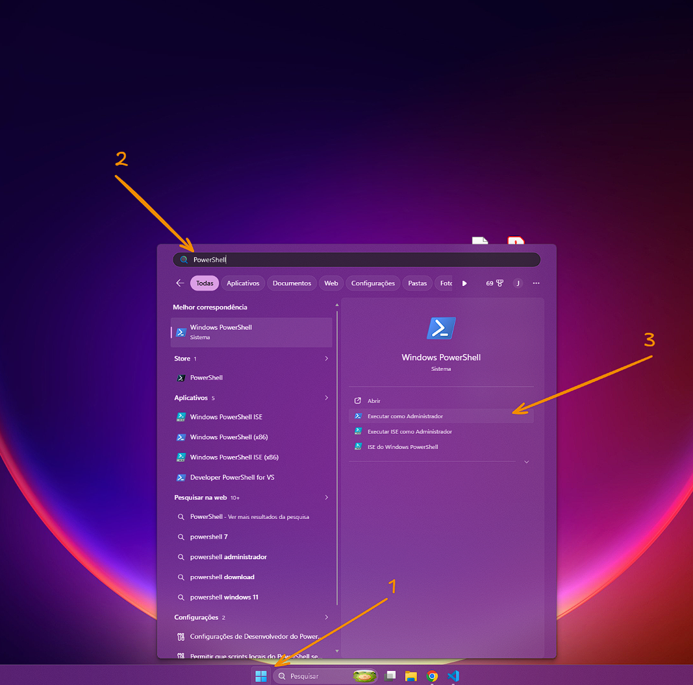

   Execute os seguintes comandos:

   ```powershell
   wsl --install
   wsl --set-default-version 2
   wsl --status
   ```

   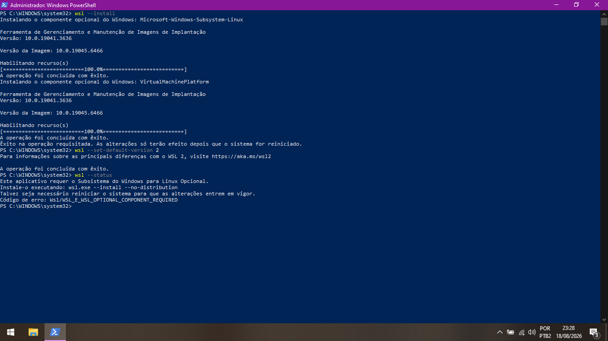

   Reinicie o computador quando solicitado.

4. Baixe e instale o Docker Desktop em [docker.com/products/docker-desktop](https://www.docker.com/products/docker-desktop/).

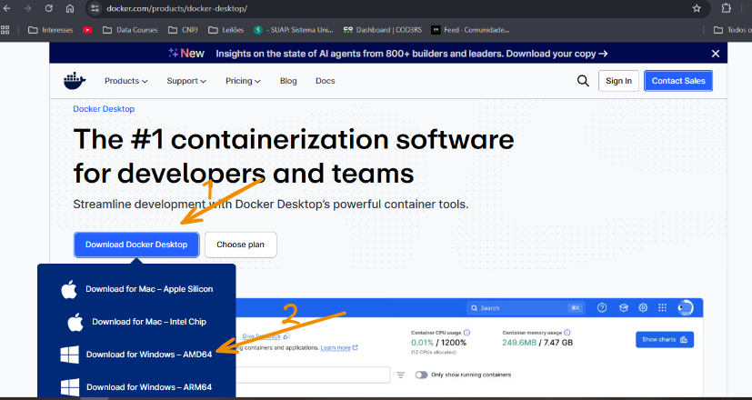
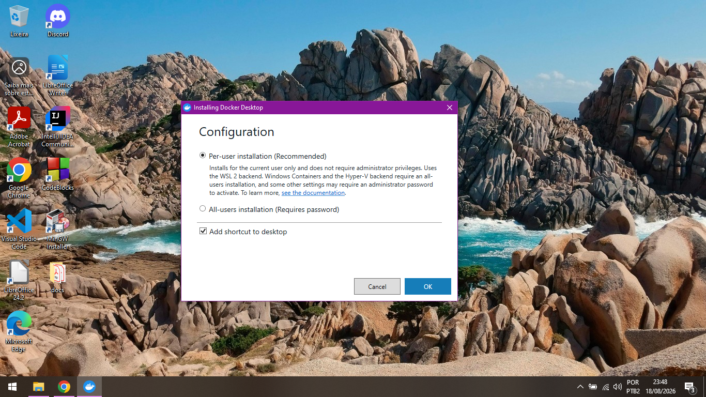

5. Abra o Docker Desktop e aceite o contrato. Em **Settings → General**, confirme que **Use the WSL 2 based engine** está marcado.
   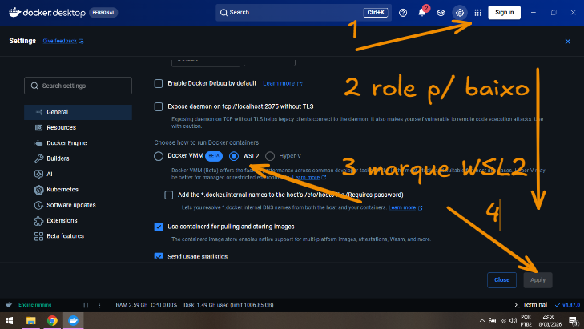

6. Verifique a instalação:

   ```powershell
   docker --version
   docker compose version
   ```

   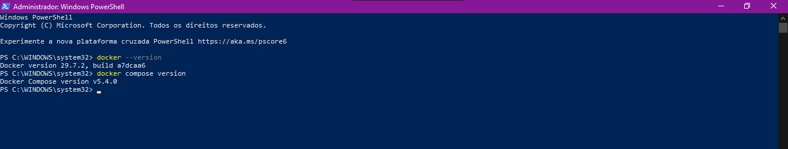

**Verificação de sucesso:** os comandos acima retornam versões sem erro e `wsl --status` mostra a distribuição padrão como WSL2.

## Etapa 2 — Git

**Objetivo:** instalar o Git, necessário para clonar o repositório e trabalhar com as branches/PRs.

- **Página oficial:** baixe o instalador em [git-scm.com/download/win](https://git-scm.com/download/win) e aceite as opções padrão.

  **Verificação de sucesso:**

  ```powershell
  git --version
  ```

    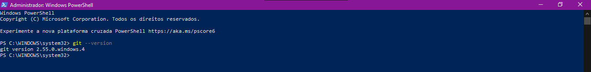

## Etapa 3 — VS Code e extensões

**Objetivo:** instalar o editor padrão do time com as extensões obrigatórias, que garantem lint, formatação e fluxo de revisão consistentes.

1. Baixe o VS Code em [code.visualstudio.com](https://code.visualstudio.com/) e instale com as opções padrão.
2. Abra o VS Code e instale as extensões pela aba Extensões (Ctrl+Shift+X) ou pelo terminal:

```powershell
code --install-extension GitHub.vscode-pull-request-github
code --install-extension dbaeumer.vscode-eslint
code --install-extension esbenp.prettier-vscode
code --install-extension ashinzekene.nestjs
```

| Extensão                                        | Obrigatória | Motivo                                       |
| ----------------------------------------------- | ----------- | -------------------------------------------- |
| GitHub Pull Requests and Issues                 | Sim         | Revisar e aprovar PRs sem sair do editor     |
| ESLint                                          | Sim         | Lint em tempo real (ADR-030/032)             |
| Prettier                                        | Sim         | Formatação consistente                       |
| NestJS                                          | Sim         | Snippets e estrutura de módulos NestJS       |
| Markdown All in One                             | Opcional    | Edição dos ADRs e documentação               |
| YAML (Red Hat)                                  | Opcional    | Edição dos `docker-compose.yml`              |
| SQLTools + SQLTools PostgreSQL/Cockroach Driver | Opcional    | Conectar no Postgres local pela aba de banco |

3. Habilite o **Format on Save**, vá em: **File** → **Preferences: Settings** ou pelo atalho `Ctrl+,`
   Selecione a opção Open Settings (JSON) no canto superior direito.

   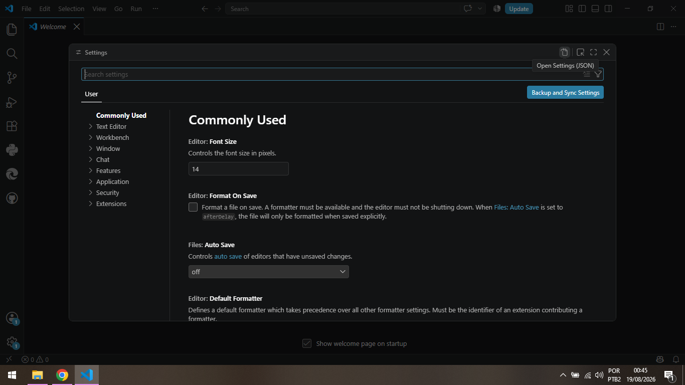

   Adicione ao final dos atributos:

   ```json
   {
     // adicione uma vírgula (,) ao final do último atributo e depois cole os atributos abaixo
     "editor.formatOnSave": true,
     "editor.defaultFormatter": "esbenp.prettier-vscode",
     "eslint.validate": ["javascript", "typescript"]
   }
   ```

   **Verificação de sucesso:**

   ```powershell
   code --version
   code --list-extensions
   ```

    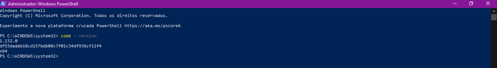

## Etapa 4 — Node.js 22.x LTS

**Objetivo:** instalar a versão LTS do Node, compatível com o Dockerfile do projeto (imagem `node:22-alpine`).

1. Baixe o instalador do Node 22.x LTS em [nodejs.org](https://nodejs.org/) e instale com as opções padrão (o instalador já inclui o `npm` e o Corepack).
   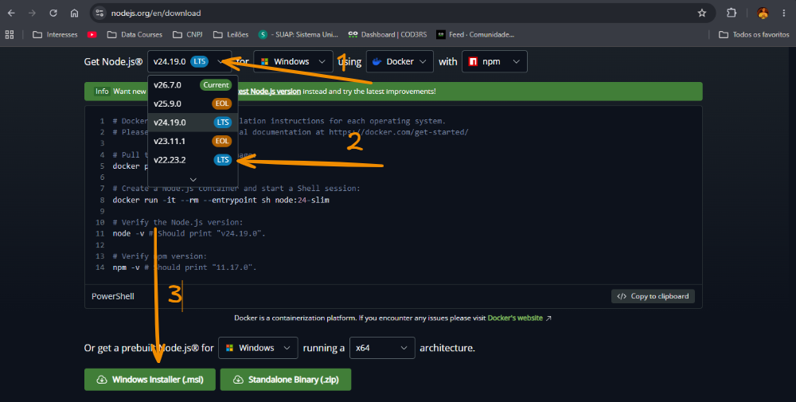

   Marque a opção de baixar e instalar os pacotes adicionais automaticamente e siga com a instalação
   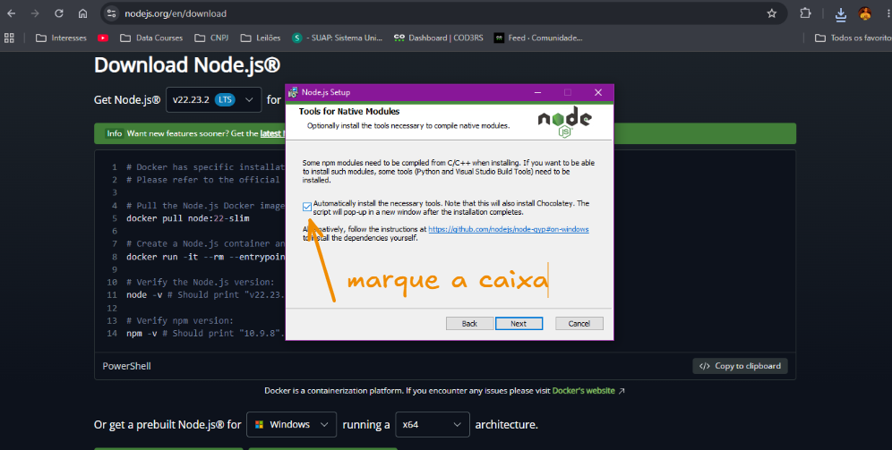

   Ao final da instalação do Node JS, um terminal abrirá e solicitará que precione uma tecla para continuar. Siga as instruções.
   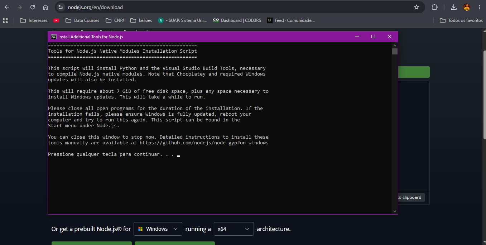

2. Reinicie o PowerShell para atualizar o PATH.

   **Verificação de sucesso:**

   ```powershell
   node --version   # deve retornar v22.x.x
   npm --version
   corepack --version
   ```

   **Alerta:**
   - Não instale o Node 24 ou mais novo como padrão local. O Dockerfile do backend usa Node 22 (alinhado ao `packageManager` do pnpm) e versões divergentes entre máquina local e container causam os erros de compatibilidade descritos no troubleshooting.
   - Caso obtenha um erro do tipo: **O arquivo ... não pode ser carregado porque a execução de scripts foi desabilitada nesse sistema ...**. Execute o seguinte comando no terminal do PowerShell escolha a opção **"S"**

   ```powershell
   Set-ExecutionPolicy -ExecutionPolicy RemoteSigned -Scope CurrentUser
   ```

   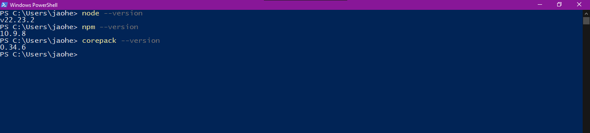

## Etapa 5 — pnpm 11.21.0

**Objetivo:** ativar o gerenciador de pacotes do monorepo (ADR-022) na versão exata usada pelo projeto, via Corepack.

1. Reinicie o PowerShell, ative o Corepack e fixe a versão:

   ```powershell
   corepack enable
   corepack use pnpm@11.21.0
   ```

O `corepack use` grava `"packageManager": "pnpm@11.21.0"` no `package.json` raiz e baixa a versão correta. 2. Se o repositório já estiver clonado, confirme que o `package.json` raiz contém `"packageManager": "pnpm@11.21.0"` e apenas execute `corepack enable`.

**Verificação de sucesso:**

```powershell
pnpm --version   # deve retornar exatamente 11.21.0
```

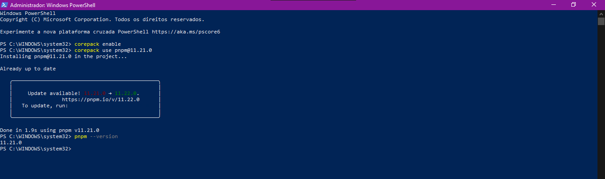

## Etapa 6 — Clone do repositório FarmaUBS

**Objetivo:** baixar o monorepo para a máquina local.

1. Crie uma pasta em seu diretório de arquivos
2. Execute o PowerShell e navegue até essa pasta
3. Copie a URL do repositório (HTTPS ou SSH, conforme seu acesso no GitHub).
4. Execute o clone no PowerShell no método desejar:

   Clone via HTTPS

   ```powershell
   git clone https://github.com/jh-ecomp/farmaubs.git
   cd farmaubs
   ```

   Clone via SSH

   ```powershell
   git clone git@github.com:jh-ecomp/farmaubs.git
   cd farmaubs
   ```

   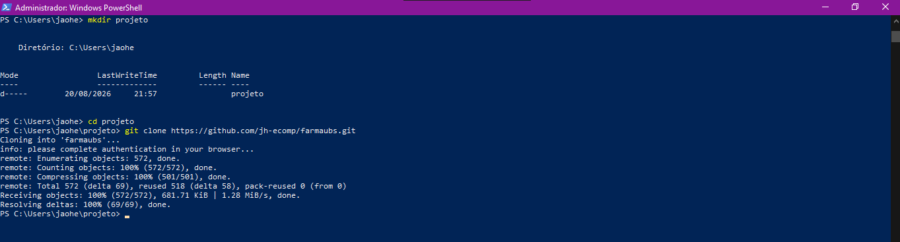

5. Confirme a estrutura:

   ```powershell
   Get-ChildItem
   ```

Deve exibir as pastas `apps/`, `packages/`, `infra/`, `docs/` e os arquivos `pnpm-workspace.yaml`, `pnpm-lock.yaml`, `.env.example`, `package.json`.

**Verificação de sucesso:** a listagem acima aparece sem erro e `pnpm-workspace.yaml` existe na raiz.

Para gerar uma chave SSH siga o seguinte tutorial: [Gerando uma nova chave SSH e adicionando-a ao agente SSH](https://docs.github.com/pt/authentication/connecting-to-github-with-ssh/generating-a-new-ssh-key-and-adding-it-to-the-ssh-agent)

## Etapa 7 — Instalação e build dos pacotes

**Objetivo:** instalar todas as dependências do monorepo e validar que os três pacotes compilam (ADR-022).

1. Na raiz do repositório, instale tudo de uma vez (backend, frontend e shared):

   ```powershell
   pnpm install
   ```

   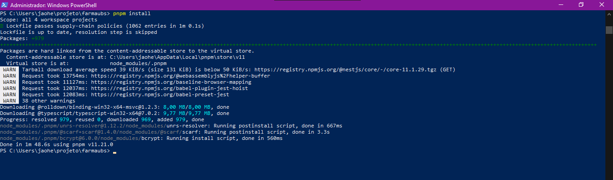

2. Compile os pacotes para validar a integridade:

   ```powershell
   pnpm build
   ```

   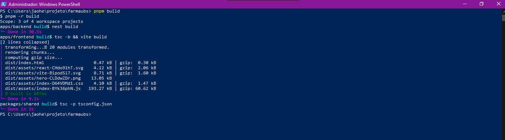

O comando executa o build de `@farmaubs/backend`, `@farmaubs/frontend` e `@farmaubs/shared`.

**Possível aviso esperado:** `ERR_PNPM_IGNORED_BUILDS` citando pacotes com scripts de build (ex.: `unrs-resolver`, `bcrypt`, `esbuild`). Não é erro de instalação: o pnpm 10+ bloqueia scripts de build por padrão. Aprove e siga:

```powershell
pnpm approve-builds
```

**Verificação de sucesso:** `pnpm build` termina sem erro e `packages/shared/dist/` contém `index.js` e `index.d.ts`.

## Etapa 8 — Configuração do Git no repositório local

**Objetivo:** associar seus commits ao seu nome e e-mail, **apenas neste repositório** (sem afetar outras máquinas ou projetos).

Na raiz do repositório (com as aspas):

```powershell
git config user.name "Seu Nome Completo"
git config user.email "seu.email@exemplo.com"
```

**Verificação de sucesso:**

```powershell
git config --get user.name
git config --get user.email
```

**Alerta:** não use `--global`. O escopo local evita sobrescrever configurações de outros repositórios da máquina e garante que o e-mail correto seja o do repositório FarmaUBS.

## Etapa 9 — Preenchimento do arquivo `.env`

**Objetivo:** criar o arquivo de ambiente local a partir do modelo versionado, com segredos próprios da sua máquina (ADR-027).

1. Copie o modelo:

```powershell
Copy-Item .env.example .env
```

2. Gere as chaves aleatórias com o Node (nunca invente ou reutilize segredos):

```powershell
node -e "console.log('POSTGRES_PASSWORD=' + require('crypto').randomBytes(24).toString('hex'))"
node -e "console.log('SESSION_SECRET=' + require('crypto').randomBytes(64).toString('hex'))"
node -e "console.log('ENCRYPTION_KEY=' + require('crypto').randomBytes(32).toString('hex'))"
```

3. Abra o `.env` e cole os valores gerados nas variáveis correspondentes. A chave `ENCRYPTION_KEY` exige **32 bytes** (o comando acima gera 64 caracteres hex, equivalentes a 32 bytes, conforme AES-256 do NF010).
4. Confira as portas que o projeto usa: **5434** (Postgres), **3000** (API), **5173** (frontend Vite). Verifique se já estão ocupadas por outros processos:

```powershell
Get-NetTCPConnection -LocalPort 5434,3000,5173 -ErrorAction SilentlyContinue |
   Select-Object LocalPort, State, OwningProcess
```

Alternativa com netstat:

```powershell
netstat -ano | findstr ":5434 :3000 :5173"
```

Se aparecerem linhas, identifique o processo que ocupa a porta:

```powershell
Get-Process -Id <PID_RETORNADO>
```

Encerre o processo (se for seguro) ou ajuste a porta no `.env`/compose antes de subir a stack.

**Verificações obrigatórias antes de prosseguir:**

- [ ] `.env` existe na raiz e foi preenchido
- [ ] `.env` **não** aparece no `git status` (o `.gitignore` deve cobri-lo; ADR-027)
- [ ] `ENCRYPTION_KEY` e `SESSION_SECRET` são valores gerados, únicos desta máquina
- [ ] Portas 5434, 3000 e 5173 livres

## Etapa 10 — Execução do projeto

**Objetivo:** subir a stack completa (Postgres, API e frontend) com um único comando (ADR-023).

1. Suba a stack de desenvolvimento:

```powershell
docker compose -f infra/docker-compose.yml -f infra/docker-compose.dev.yml up -d
```

A primeira execução constrói as imagens e pode levar alguns minutos. 2. Confirme que os três serviços estão de pé:

```powershell
docker compose -f infra/docker-compose.yml -f infra/docker-compose.dev.yml ps
```

3. Acompanhe os logs da API:

```powershell
docker compose -f infra/docker-compose.yml -f infra/docker-compose.dev.yml logs -f api
```

**Acessos após a subida:**

| Serviço         | Endereço                |
| --------------- | ----------------------- |
| Frontend (Vite) | `http://localhost:5173` |
| API (NestJS)    | `http://localhost:3000` |
| PostgreSQL      | `localhost:5434`        |

**Parar a stack:**

```powershell
docker compose -f infra/docker-compose.yml -f infra/docker-compose.dev.yml down
```

**Alerta:** `down` preserva os dados do Postgres (volume). Use `down -v` apenas se quiser apagar o banco local e recomeçar do zero.

## Checklist final de validação

- [ ] `docker --version` e `docker compose version` funcionam
- [ ] `git --version` retorna versão
- [ ] `node --version` retorna v22.x
- [ ] `pnpm --version` retorna 11.21.0
- [ ] `pnpm install` e `pnpm build` concluem sem erro
- [ ] `git config user.name` e `user.email` retornam seus dados
- [ ] `.env` criado, preenchido e fora do `git status`
- [ ] `docker compose ... up -d` sobe os três serviços
- [ ] Frontend acessível em `http://localhost:5173`

## Troubleshooting rápido

| Sintoma                                           | Causa provável                                      | Correção                                                                                                                      |
| ------------------------------------------------- | --------------------------------------------------- | ----------------------------------------------------------------------------------------------------------------------------- |
| Docker Desktop não inicia                         | Virtualização desativada na BIOS                    | [Habilitar virtualização no Windows](https://support.microsoft.com/pt-br/windows/experience/enable-virtualization-on-windows) |
| `wsl` retorna erro de versão                      | WSL desatualizado                                   | `wsl --update` e `wsl --set-default-version 2`                                                                                |
| `pnpm install` avisa `ERR_PNPM_IGNORED_BUILDS`    | pnpm 10+ bloqueia scripts de build                  | `pnpm approve-builds` ou `onlyBuiltDependencies` no `pnpm-workspace.yaml`                                                     |
| Build do Docker falha com `node:sqlite`           | pnpm 11 exige Node 22+ e a imagem usa Node 20       | Confirmar imagem `node:22-alpine` no Dockerfile                                                                               |
| Porta 5434/3000/5173 ocupada                      | Processo local pré-existente                        | Encerrar processo ou ajustar porta no `.env`                                                                                  |
| `git add apps/backend` acusa repositório aninhado | `nest new` criou `apps/backend/.git`                | `Remove-Item -Recurse -Force apps/backend/.git`                                                                               |
| API não acha o banco                              | `DB_HOST` com `localhost` em vez do nome do serviço | Usar `DB_HOST=postgres` (nome do serviço no compose)                                                                          |
